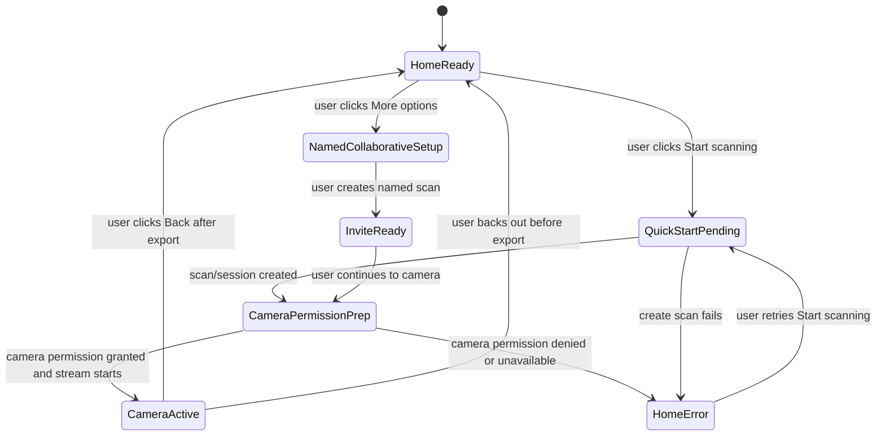

# Design: Quick-start scan flow

## Intent
The home screen should optimize for solo capture. Collaboration and naming remain available, but neither blocks a user from reaching the camera.

## Current state
Current solo path:

`Open app -> New scan -> enter name -> Create scan -> Continue to camera`

Existing code already stores scans and sessions in IndexedDB and can re-enter a session row from the sessions list. However, this is not presented as a primary resume UX and there is no explicit unfinished-scan model in this change.

## Proposed interaction model

- Home primary action: **Start scanning**.
- On click, create a scan with no required reference name.
- While the create request is in flight, keep the user on home and change the action to **Starting camera…**.
- On success, navigate to `/#/session/<sessionId>`.
- On failure, stay on home, restore the primary action, and show an inline recovery message.
- `CaptureView` owns camera-permission preparation: it renders **Allow camera access to photograph shelf spines.** before its first camera stream request when camera startup is pending.
- Existing named/collaborative creation remains accessible through a secondary **More options** action.
- Previous sessions remain visible below the primary action as **Previous scans**.

## FSM

## State details

| State | User-visible evidence | Allowed mutation |
|---|---|---|
| `HomeReady` | **Start scanning** button enabled; previous scans visible below | none |
| `QuickStartPending` | Primary button says **Starting camera…** and is disabled | one create-scan request |
| `CameraPermissionPrep` | `CaptureView` message: **Allow camera access to photograph shelf spines.** | first camera stream request for the session |
| `CameraActive` | Capture UI visible | capture records, export |
| `HomeError` | Inline error: **Couldn’t start scan. Check connection/storage and try again.** | retry only after checking no success evidence is already present |
| `NamedCollaborativeSetup` | Existing name/invite/join form | create/join request through existing forms |
| `InviteReady` | QR invite and **Continue to camera** visible | none |

## Selector and wait policy

- Tests select by role and accessible name, e.g. `getByRole('button', { name: 'Start scanning' })`.
- Tests must not use CSS or XPath selectors for behavioral assertions.
- E2E waits anchor on visible text, route change, camera UI visibility, or mocked network completion; no sleeps.
- Retry tests verify success evidence before issuing a second create mutation.

## Duplicate prevention

The quick-start button is disabled while creation is pending. During a mounted home view, the in-flight `CreateScanResult` promise is the success evidence. After remount or retry, a persisted IndexedDB session is the success evidence. If `createScan` returns a result but route navigation is interrupted, the view must navigate to that returned `session.id` instead of issuing another create request.

If the remote/API create succeeds but local IndexedDB persistence fails, the quick-start flow has no durable session to navigate to. The UI must show the standard quick-start error, and a retry may issue a new create request because no local success evidence exists. Backend/API idempotency for this partial failure remains outside this UI change.

## Non-goals

- Defining a new explicit resume/unfinished scan model.
- Removing the existing named/collaborative creation path.
- Requiring human-readable scan names for identity.
